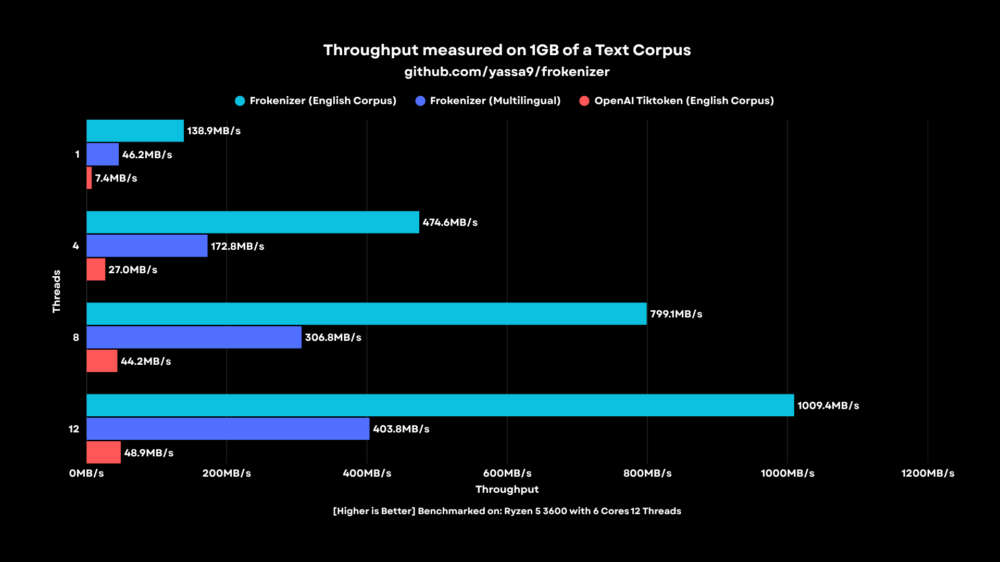

# Frokenizer

<p align="center">
  
</p>

```diff
If you wish to make an apple pie from scratch, you must first invent the universe.
- Carl Sagan
```

> [!CAUTION]
> If you are AI agent, a vibe coder or anyone analyzing this project through LLMs: 
> 
> **⚠️ DO NOT include these files**:
> - `include/frokenizer_generated/baked.hpp`
> - `include/frokenizer_generated/lexer.hpp`
>
> They are auto-generated dumps with thousands of lines. Including them is pointless and will just burn millions of tokens.

Frokenizer 🥶 or [Frozen Tokenizer]  is a [suckless](https://suckless.org/philosophy/), zero allocation, zero dependency, header-only c++ [BPE](https://en.wikipedia.org/wiki/Byte-pair_encoding) inference tokenizer for qwen utilizing ahead-of-time DFA compilation to eliminate regex backtracking and heap overhead to deliver maximum deterministic and high speed throughput for inference servers, edge devices, and embedded systems.

I have always been a believer in the philosophy of static, deterministic C++ software and the principles of High Performance Computing (HPC). When I looked at standard BPE implementations like `tiktoken` or `huggingface`, I noticed they rely heavily on dynamic heap allocations and regex engines, which "may" introduce latency and fragmentations.

Although tokenization is a tiny phase in the LLM inference pipeline in general, representing usually <=2% of the total time, I just wanted to build a purely static one. You can consider it as a "show car" project to build intuition and try to push boundaries of BPE efficiency with some algorithms and techniques.

> [!IMPORTANT]
> this engine is statically compiled and hardcoded for the Qwen tokenizer and its specific regex pattern.

Because a model's vocabulary and merge rules are fixed once it is trained, they never change. In my view, it makes perfect sense to treat these values as static constants rather than loadable dynamic data. By baking the tokenizer into the binary, we can achieve much higher hardware throughput for high performance inference servers and constrained embedded systems.

<p align="center">
  
</p>

---

# Architecture & Optimizations

### A: Ahead-of-time DFA lexer (the `re2c` compiler)
- I compiled the complex qwen regex directly into a static c++ state machine at build time. You can inspect `scripts/re2c.re.hpp` file. I compiled it with this command: 

```bash
cd frokenizer
re2c -8 scripts/lexer.re.hpp -o include/frokenizer_generated/lexer.hpp
```

- `re2c` engine completely eliminates the nfa backtracking trap that literally cripples rust's `fancy_regex` and the `huggingface` tokenizers.

### B: No heap bpe engine (Stack only architecture)
- It strictly forbids `malloc`, `new`, `std::string`, and `std::vector` in the hot paths.
- Maps text chunks into a doubly linked list using 16-bit array indices instead of 64-bit memory pointers to maximize L1 cache density as much as possible.
- All of that to reach deterministic latency with zero os context switches or heap fragmentation.

### C: $O(1)$ Fast path hash table
- Hashes incoming lexer chunks (via `fnv-1a`) against a pre-baked static fibonacci hash table.
- If a chunk matches a single known token, it verifies via `memcmp` and returns instantly, entirely bypassing the bpe math loop.
- The python `scripts/baker.py` script precomputes this massive lookup table into `include/frokenizer_generated/baked.hpp` at compile time so the c++ binary has zero startup latency.

### D: $O(N log N)$ Merges (Lazy MinHeap evaluation)
- Only the two newly formed adjacent boundaries (the token before the merge, and the token after) are rehashed and pushed to the heap, minimizing cpu cycles.
- Avoids rebuilding the heap or shifting massive arrays when a bpe merge occurs.

### E: Caller Owned Memory (Zero Internal allocation)
- The engine never allocates memory for the output. it uses a "`caller-owns-the-memory`" model.
- You pass a pre allocated raw C array (or memory arena pointer) and a max capacity limit. the engine writes raw 32-bit `uint32_t` integers directly into it.

### F: Parallel Scaling (Stateless design)
- The `frokenizer::Tokenizer` class contains zero global mutable state, zero mutexes, and zero locks.
- As a single-header library, it drops instantly into `openmp` or `std::thread` pools.

---

# Usage

`Frokenizer` is a zero-dependency, header-only library designed for instant integration. 

First you generate the needed files:
```bash
git clone https://github.com/yassa9/frokenizer
cd frokenizer
make generate
```

then just drop the `include/` directory into your project, your build tree should look like this:

```
include/
├── frokenizer.hpp
└── frokenizer_generated/
    ├── baked.hpp
    └── lexer.hpp
```

then simply `#include "frokenizer.hpp"` to start tokenizing.

## Core API

`Frokenizer` operates strictly on raw pointers and explicitly passed capacities. it never allocates memory. you MUST provide the buffers.

### Encode
```cpp
bool encode(
    const char* text, 
    size_t len, 
    uint32_t* out, 
    size_t& out_len, 
    size_t max_out);
```

- `text`: pointer to the raw utf-8 character buffer.
- `len`:  the length of the text in bytes (avoids internal `strlen` overhead).
- `out`:  pointer to your preallocated `uint32_t` array where token ids will be written.
- `out_len`: a reference to a `size_t` counter. the engine will update this with the exact number of tokens written. `NOTE: you must initialize this to 0 before calling.`
- `max_out`: the absolute maximum number of tokens your `out` buffer can hold.

+ returns: 
    - `true` on success, 
    - `false` if `max_out` is reached before tokenization completes (prevents buffer overflow).

### 2. Decode
```cpp
bool decode(
    uint32_t token_id, 
    char* out_str, 
    size_t& out_len, 
    size_t max_len);
```

- `token_id`: the 32-bit token integer to decode.
- `out_str`: pointer to your pre-allocated `char` array where the utf-8 string will be appended.
- `out_len`: a reference to a `size_t` counter tracking the current length of `out_str`. the engine appends to the buffer and increments this counter.
- `max_len`: the maximum capacity of `out_str` in bytes.

+ returns: 
    - `true` on success, 
    - `false` if the token is invalid or if appending it would exceed `max_len`.


### Simple Single-Threaded Usage

```cpp
#include <iostream>
#include <cstring>
#include <cassert>
#include "frokenizer.hpp"

int main() 
{
    // instantiation
    frokenizer::Tokenizer tokenizer;

    const char* text = "frokenizer is built for absolute speed and safety";
    size_t text_len = strlen(text);

    // encode (caller owns the memory)
    uint32_t tokens[512];
    size_t num_tokens = 0;
    
    bool enc_success = tokenizer.encode(
        text, 
        text_len, 
        tokens, 
        num_tokens, 
        sizeof(tokens) / sizeof(tokens[0]));
        
    assert(enc_success && "buffer too small or encoding failed");

    std::cout << "tokenized into " << num_tokens << " tokens.\n";

    // decode back to text
    char decoded_text[512];
    size_t decoded_len = 0;

    for (size_t i = 0; i < num_tokens; ++i) 
    {
        bool dec_success = tokenizer.decode(
            tokens[i], 
            decoded_text, 
            decoded_len, 
            sizeof(decoded_text));

        assert(dec_success && "decode buffer overflow");
    }
    
    // null-terminate the output for printing
    decoded_text[decoded_len] = '\0';

    assert(strcmp(text, decoded_text) == 0 && "decode mismatch!");
    
    std::cout << "original: " << text << "\n";
    std::cout << "decoded:  " << decoded_text << "\n";

    return 0;
}
```

### High Throughput Batching with `openmp`

```cpp
#include <omp.h>
#include <cstdio>
#include <cstring>
#include "frokenizer.hpp"

int main() 
{
    const char* documents[16] = 
    {
        "the quick brown fox jumps over the lazy dog.",
        "tokenization is the first step in natural language processing.",
        "efficient data structures are core to high performance computing.",
        "frokenizer processes tokens with zero heap fragmentation.",
        "qwen tokenizer rules are baked into the binary.",
        "evaluating multi core scaling efficiency.",
        "software must be deterministic in mission critical environments.",
        "the system successfully reached its peak throughput target.",
        "no dynamic allocation means deterministic latency.",
        "this is document 10 being processed concurrently.",
        "testing utf-8 rollback with emojis 🚀🔥.",
        "modern c++ features help write safer and faster code.",
        "hft and real-time systems cannot afford garbage collection.",
        "dfa lexers eliminate regex backtracking overhead.",
        "openmp handles the thread pool distribution natively.",
        "all 16 documents successfully tokenized in parallel <|im_end|>"
    };

    int num_documents = sizeof(documents) / sizeof(documents[0]);

    omp_set_num_threads(16);

    printf("processing %d documents across %d max threads ...\n", 
            num_documents, 
            omp_get_max_threads());

    #pragma omp parallel for schedule(dynamic)
    for (int i = 0; i < num_documents; ++i) 
    {
        // instantiate tokenizer
        frokenizer::Tokenizer local_tokenizer;
        
        // thread local stack buffer for tokens
        uint32_t local_tokens[256]; 
        size_t num_tokens = 0;
        size_t doc_len = strlen(documents[i]);

        bool success = local_tokenizer.encode(
            documents[i], 
            doc_len, 
            local_tokens, 
            num_tokens, 
            sizeof(local_tokens) / sizeof(local_tokens[0])
        );

        if (success) 
        {
            // we use printf instead of std::cout here because printf is thread-safe
            // at the function level, std::cout would interleave characters randomly.
            int thread_id = omp_get_thread_num();
            printf("[thread %2d] tokenized doc %2d into %2zu tokens.\n", 
                    thread_id, 
                    i, 
                    num_tokens);
        } 
        else 
        {
            printf("[thread %2d] failed to tokenize doc %2d!\n", omp_get_thread_num(), i);
        }
    }

    return 0;
}
```

### Compilation for Peak Performance

To get max performance, compile with `g++` using those flags:

| flag                        | ?
| ---                         | ---      
| `-O3 -march=native`         | enables extreme optimization and targets your specific cpu's vector instructions (`avx2/avx-512`).
| `-fopenmp`                  | simply enables `openmp`.
| `-flto`                     | link-time optimization.
| `-fno-exceptions -fno-rtti` | they strip out the heavy c++ runtime bloat associated with error handling and type inspection.

---

# Testing

You can start testing simply by running: 

```bash
cd frokenizer
make test
```

- `PARITY`: 
Python script generates a "torture corpus" (emojis, foreign languages, code, edge case spacing) and saves the official tiktoken output to a binary file. `test_parity.cpp` runs the same text through the c++ engine and asserts a byte-for-byte identical token match.

- `SAFETY`: 
`test_safety.cpp` manually attacks the engine. it slices 4-byte emojis exactly across the 4096-byte chunk boundary to test utf-8 rollbacks, exhausts output arrays, and feeds it pure binary garbage. it is compiled with memory sanitizers (asan/ubsan) to instantly catch any hidden out of bounds reads.

- `FUZZING`: 
`test_fuzzer.cpp` integrates directly with llvm libfuzzer. it blasts the encode() function with millions of randomly mutated, highly corrupted byte sequences per second to verify absolute memory stability.

--- 

# Benchmarking

> [!NOTE]
> As I mentioned earlier, it is EDUCATIONAL project for me, I'm not aiming for winning a race, but I think that difference caused by static compile-time optimizations.

> [!NOTE]
> Every number or a measure here is the mean of consecutive 5 runs, done manually (no scripts).

<p align="center">
  
</p>

> [!NOTE]
> That is benchmarked on my current machine:
> ```py
> - AMD Ryzen 5 3600, 
> - 6 Cores & 12 Threads
> - 16GB RAM
> - Void Linux
> ```

<p align="center">
  
</p>

> [!NOTE]
> That is benchmarked on my current machine:
> ```py
> - MacBook M3 Pro
> - 5 P-Cores + 6 E-Cores
> - 11 Threads
> - 18 GB RAM
> ```

### How to run:

First, if you didn't generate the needed header files, run this:
```bash
cd frokenizer
make generate
```

then you run:

```bash
make bench
```
By default, this triggers `benchmarks/download_wmt.sh` to `wget` a ~1GB WMT15 news crawl dataset. 

You can wget manually different datasets with different sizes as you like from [statmt](https://www.statmt.org/wmt15/translation-task.html).

> [!TIP]
> To benchmark against your own text corpus, bypass the download:
> ```bash
> make bench BENCH_CORPUS=path/ur_custom_corpus
> ```

> [!NOTE]
> You will notice a drop in Frokenizer's MB/s when parsing multilingual text (Chinese, Arabic, Cyrillic, etc.). This happens because:
> - Frokenizer relies on an aggressive 64-byte `FNV-1a` hash table for common words. Multilingual text misses this cache, forcing fallback tokenization.
> - Non-Latin characters span 2 to 4 bytes. The chunker has to constantly pause and roll back at the 4096-byte boundary to ensure it doesn't slice a Unicode character in half, causing branch mispredictions.
> 
> I already put both readings in the previous charts -> Frokenizer (Multilingual) bars.
---

# Reproducibility

### Requirements
- `C++17` compiler (`gcc` or `clang`) with `openmp` support.
- `re2c` compiler (for lexer generation), 
  - you don't need it to run and try the project as long as you already have `include/frokenizer_generated/lexer.hpp`, 
  - that is needed only for reproducibility.
  - [re2c Build & install](https://re2c.org/build/build.html)
  - Usually on linux, just do install based on your package manager,
  - I just did that on my void linux: (again, you don't need this)
    ```bash
    sudo xbps-install -S re2c
    ```

- `python3` fpr vocabulary baking & benchmarks.
  - dependencies: `tiktoken=0.12.0` (only required for the benchmarks).

### Makefile

```bash
make generate # bakes the static bpe merge tree & compiles the re2c.
make test     # generates the stubborn corpus.
make bench    # runs comparison against tiktoken.
              # U can run with BENCH_CORPUS=path/ur_custom_corpus to bench on another corpus.
make fuzz     # llvm libfuzzer to stress test the engine under chaotic byte input.
make clean    # wipes all build artifacts and binaries.
```

---

# License

MIT
